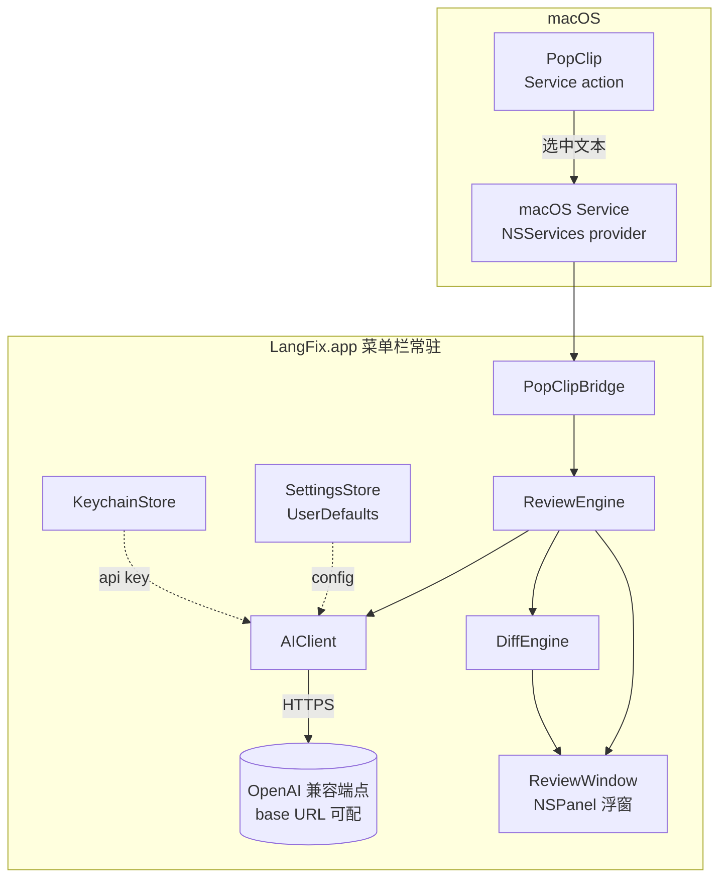

<!-- doc-init template version: v1.0 -->
# Architecture Overview

> **Owner**: n374
> 架构总览：每个专题给提要 + 链接，详情走专题/模块文档。

## 架构原则

1. **常驻 + 轻触发**：菜单栏常驻进程，触发即出窗，不为每次纠错冷启动。
2. **单向数据流**：Service 输入 → ReviewEngine → AIClient → 结构化结果 → ReviewWindow 渲染，单向无环。
3. **端点无关**：AI 层面向「OpenAI 兼容 Chat Completions」抽象，不绑定具体厂商；能力差异用降级策略吸收。
4. **结果可信优先**：结构化输出 + 客户端 schema 校验 + 最小改动护栏，三道闸保证可渲染、可信、可核对。
5. **隐私默认**：密钥隔离、内容不落盘（见 [constitution](../overview/constitution.md)）。

## 关键不变式

> 违反则需走 change 流程（见 constitution 红线）。

1. `corrected` 是 `original` 的最小改动版；diff 比例护栏不可移除（[ADR-0004](../decisions/0004-minimal-edit-guard.md)）。
2. API key 只经 `KeychainStore`，不进任何其他存储/日志。
3. AIClient 对外只暴露「输入文本 → 校验过的结构化结果」，调用方不感知端点能力差异（json_schema / json_object / 纯文本由 AIClient 内部降级）。
4. ReviewWindow 不持有/不修改用户原选区。

## 系统组成

## 模块文档地图

| 模块 | 文档 | 职责 |
|---|---|---|
| PopClipBridge / Service | [modules/popclip-service.md](./modules/popclip-service.md) | 注册 macOS Service、接收选中文本、唤起 review，含 PopClip 扩展 snippet |
| ReviewEngine + AIClient | [modules/ai-client.md](./modules/ai-client.md) | AI 调用、结构化输出降级、schema 校验、过度改写护栏与重试 |
| ReviewWindow + DiffEngine | [modules/review-window.md](./modules/review-window.md) | 浮窗 UI、词级 diff 渲染、错误清单、复制与二次操作 |

## 横切话题

| 话题 | 文档 | 提要 |
|---|---|---|
| 数据流 | [data-flow.md](./data-flow.md) | 触发 → AI → 渲染的端到端时序、I/O Schema、护栏与错误路径 |
| 技术栈选型 | [tech-stack.md](./tech-stack.md) | 平台/语言/触发/AI 接入/密钥/分发的选型与理由，含配置项清单 |

## 关联资源

- 决策记录：[../decisions/README.md](../decisions/README.md)
- Living spec：[../specs/grammar-review/spec.md](../specs/grammar-review/spec.md)
- 红线：[../overview/constitution.md](../overview/constitution.md)
