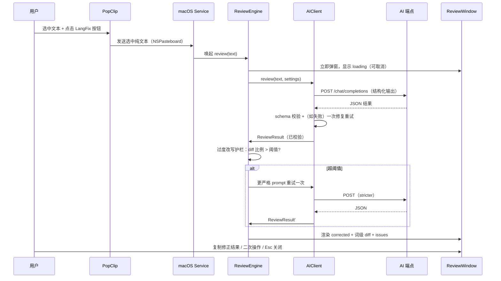

<!-- doc-init template version: v1.0 -->
# 数据流 / Data Flow

> **Owner**: n374
> 触发 → AI → 渲染的端到端时序、输入输出 Schema、护栏与错误路径。

## 1. 端到端时序



## 2. 输入

- **来源**：PopClip Service action 发送的**纯文本**（`public.utf8-plain-text`）。
- **预处理**：trim 首尾空白；保留内部换行；空文本或超长（> `maxChars`，默认 4000）直接拒绝并提示（见 spec R8）。

## 3. AI 输出 Schema（ReviewResult）

> AIClient 内部把 AI 返回的 JSON 解析并校验为下列结构后才交给上层。字段稳定是 UI 可靠渲染的前提。

```jsonc
{
  "has_issues": true,                  // 是否存在需修改项
  "original": "...",                   // 回显（用于 diff 与校验）
  "corrected": "最小改动修正版",         // 主结果
  "summary_zh": "一句话总评（中文）",
  "issues": [
    {
      "category": "grammar|spelling|word_choice|naturalness|tone|punctuation",
      "severity": "error|improvement|optional",
      "before": "原文片段（须为 original 的精确子串，供 diff 定位）",
      "after": "修正片段",
      "reason_zh": "中文解释：哪里错 / 为什么错 / 怎么改更自然"
    }
  ],
  "alternative": "可选：更地道的整体改写（明确标注为「非最小改动版」，可为空）"
}
```

**校验规则（客户端）**：
1. `corrected` / `original` / `has_issues` 必填且类型正确。
2. **基准一致性**：AI 回显的 `original` 必须等于本地真实输入（trim 后逐字符比较）。**不一致**说明模型擅自改写了输入——此时**以本地输入为准覆盖** `result.original`，diff 与最小改动护栏一律基于本地输入计算，绝不基于模型回显（否则 diff/护栏会被模型「洗白」）。
3. `has_issues=false` 时 `corrected` 必须等于本地输入（已无需改动），`issues` 可为空。
4. 每个 `issue.before` 应为本地输入的子串（用于 diff 高亮锚定）；不满足时降级为「整体 diff」而非逐条锚定（不阻断展示）。
5. **截断/拒答**：若响应 `finish_reason == "length"`（被 max_tokens 截断）或返回非法/不完整 JSON 或 refusal → 进「修复/重试」（见下）。
6. 校验失败 → 一次「修复重试」（把校验错误回传给模型要求修正；截断则提高 max_tokens 重发一次）；再失败 → 退化为「纯文本展示（以本地输入为 corrected）+ 错误提示」。

## 4. 过度改写护栏（最小改动闸）

详见 [ADR-0004](../decisions/0004-minimal-edit-guard.md)。

- **基准**：以本地真实输入为 `original`（见 §3 规则 2），词级编辑比例 `ratio = editedWords / max(origWords, 1)`。
- **短句豁免**：`origWords < 6` 或 `editedWords <= 2` 时跳过比例护栏（短消息一个必要替换比例天然高，按比例拦截会误伤）。
- `ratio > threshold`（默认 0.35，可配）→ 用更严格 prompt 重试**一次**（强调「只改必要错误，逐词保留」）。
- 重试后仍 `> threshold` → **展示两轮中 `ratio` 较小的一版**，窗口顶部加 banner：「⚠️ AI 改动较大，请逐条核对」。护栏**不阻断出结果**。
- 该护栏不可默认关闭（红线 Constraint-3）。

## 5. 错误与边界路径

| 情况 | 行为（对应 spec） |
|---|---|
| 空文本 / 超长 | 弹窗提示拒绝，不发请求（R8） |
| 网络失败 / 超时 | 显示错误 + 「重试」按钮；不崩溃（R7） |
| 鉴权失败 401/403 | 提示「检查 API key / 端点」并给设置入口（R7） |
| 限流 429 | 提示稍后重试，可附 backoff（R7） |
| 端点不支持 `json_schema` | AIClient 自动降级 `json_object` → 纯文本解析（R6） |
| 模型返回非法 JSON | 修复重试一次 → 仍失败则纯文本展示（R6） |
| `finish_reason=length`（被截断）| 提高 max_tokens 重发一次 → 仍截断则纯文本展示并提示（R6） |
| refusal / 非 schema 文本 | 视为校验失败走修复重试 → 仍失败则纯文本展示（R6） |
| AI 回显 original ≠ 本地输入 | 以本地输入覆盖基准，diff/护栏均基于本地输入（§3 规则 2） |
| 原文已正确 | `has_issues=false`，标注「无明显错误」，可给可选优化（R11） |
| 多语言混排 | 只修目标语言，不翻译其余语言（R12） |

## 6. 关联资源

- 模块细节：[modules/ai-client.md](./modules/ai-client.md)、[modules/review-window.md](./modules/review-window.md)
- 需求与覆盖测试：[../specs/grammar-review/spec.md](../specs/grammar-review/spec.md)
