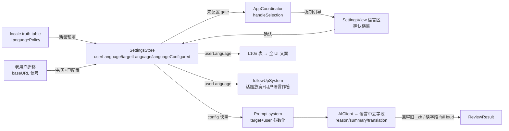

<!-- doc-init template version: v1.0 -->
# Design: language-config（语言配置 / i18n）

- **Owner**: 技术方案官（Claude / Fable）on behalf of wu.nerd
- **Reviewers**: Codex（对抗式评审）、wu.nerd
- **状态**: Reviewed（Codex 对抗式评审 3 轮，终审通过）
- **创建日期**: 2026-07-17
- **关联**: [proposal.md](./proposal.md) · [spec-delta](./specs/grammar-review/spec.md) · RAS-57
- **共享分支**: `feat/language-config-i18n`（基于 `feat/53-ai-followup`）

## 1. 概述

把 LangFix 从「母语写死中文、目标语言默认英文」改造为**双语言可配**：

- **用户语言**（母语）：驱动全部 UI 文案 + AI 解释/总评/直译语言；
- **目标语言**（被纠错语言）：驱动纠错对象与**混排统一方向**（行为反转：非目标语言片段转写为目标语言）；
- 新装首启强制配语言、老用户升级自动迁移；
- 结构化字段 `reason_zh`/`summary_zh`/`translation_zh`/`alternative_reason_zh` 去后缀为语言中立字段 + 旧字段兼容 + 关键字段缺失 fail loud；
- 追问话题放宽为任意语法/语言问题，其余护栏（不改主结果 / 不吐替代全文 / 易失内存 / 注入防御）原样保留。

**红线**：Constraint-2/3 不弱化；最小改动护栏（editRatio → strict retry → overEdited）**流程**零改动，仅结果择优规则增加「统一不回退」维度（只会更严，见 D8/D9）。

## 2. 现状与约束（实测锚点）

| # | 现状事实 | 位置 |
|---|---|---|
| C1 | system prompt 写死「用户母语是中文」「用【中文】逐条解释」；规则 4「多语言混排：只修目标语言片段，不翻译其余语言」 | `Prompt.swift:13-25` |
| C2 | strict 重试附加段「逐词保留用户原文」，未提混排转写 | `Prompt.swift:8-10` |
| C3 | 追问 system 约束#2「范围锚定本次结果」、#4「一律用简体中文回答」 | `Prompt.swift:60-73` |
| C4 | `Issue.reasonZh`/`ReviewResult.translationZh|summaryZh|alternativeReasonZh` 经 CodingKeys 映射 `_zh` JSON 名；解码**全 lenient**，任何字段缺失都静默缺省（`""`），从不抛错 | `Models.swift:52-55,102-111,126-136` |
| C5 | `parseAndValidate` 只在「非合法 JSON」时 throw `ReviewError.decode`；上游 per-tier 走 `repairHint` 修复重试 → 全 tier 仍败时**并不进错误态**，而是返回 `ReviewResult.fallback`（`hasIssues=false, corrected=原文, summary="解析失败，已尽力展示原文"`）**当成功结果展示**；流式路径同构 | `AIClient.swift:642-655,94-121,160-205`、`Models.swift:139-142` |
| C6 | 流式解析器按字段名字符串扫描 `"translation_zh"`/`"summary_zh"` 等；仅供预览，正确性恒由 `parseAndValidate` 定 | `PartialReviewParser.swift`（字段名常量） |
| C7 | `SettingsStore` = UserDefaults + `@Published/didSet` + `register(defaults:)`；无任何 onboarding 机制 | `SettingsStore.swift:12-64` |
| C8 | 触发链路：`ServiceProvider → AppCoordinator.handleSelection`，`cfg.isComplete` 不满足 → `presentConfigNeeded`（NSAlert + 开设置） | `AppCoordinator.swift:32-47,218-226` |
| C9 | 护栏编排：editRatio/换行破坏 → strict 重试一次 → 仍超 → `overEdited=true` 始终出结果；strict-throw 时定稿 firstPass+overEdited | `ReviewEngine.swift` |
| C10 | UI 零 i18n 基建：无 NSLocalizedString/String Catalog；中文文案散布 `ReviewView`(~90 处)、`SettingsView`(~20)、`App.swift` 菜单、`Models.swift` badge 与 `missingFields`、`ReviewError` 文案、`AppCoordinator` alert | 各文件 |
| C11 | SPM 工程，macOS 13+ | `Package.swift:6` |
| C12 | 追问上下文/快照用 `summaryZh`/`reasonZh` 字段名组装 | `Prompt.swift:84-109`、`Models.swift:269` |
| C13 | `docs/changes/font-size-setting/` 在本分支不存在（RAS-54 在其自身分支）；重叠文件 `SettingsStore/SettingsView/ReviewView` | 本分支实测 |

## 3. 关键设计决策（D1–D12）

### D1 语言域模型：`AppLanguage` 双键存储，V1 单自由度、双键留扩展

```swift
enum AppLanguage: String, Codable, CaseIterable, Sendable {
    case chinese = "zh", english = "en"
}
```

- `SettingsStore` 新增键：`userLanguage: String`（rawValue）、`targetLanguage: String`、`languageConfigured: Bool`。
- **不变式：目标语言 ≠ 用户语言**。V1 两语言集均为 {中,英}，故目标语言实际由用户语言唯一确定；仍**持久化两个键**，为后续扩目标语言集留位（届时只放宽 UI 约束，存储不迁移）。
- 不变式由三层共同保证：① UI 层自动翻转（见 D3）；② `SettingsStore` 读取时校验，发现相等（手改 defaults / 脏数据）→ 目标语言强制翻转为另一语言（确定性修复，不 crash）；③ 纯函数 `LanguagePolicy.normalized(user:target:)` 承载该规则，可单测。

### D2 迁移与首启判定：`languageConfigured` 键 + 「持久化 baseURL 存在」作老用户信号

`SettingsStore.init()` 中执行一次确定性迁移（早于任何读取）：

| 条件（`languageConfigured` 键不存在时） | 判定 | 动作 |
|---|---|---|
| **存在任一旧版使用痕迹**：任一 v1 已知 UserDefaults 键有持久化值（经 `persistentDomain(forName:)` 只查**落盘域**，不得用 `object(forKey:)`——后者会命中进程全局 registration domain 的注册默认值，把新装误判为老用户；空域返回 nil 按新装处理。MR 复验缺陷修复，回归锚 `testMigrationImmuneToRegistrationDomainPollution`）**或** Keychain 存有 API key | 老用户升级 | 写入 用户=中、目标=英、`languageConfigured=true`（等价现状，不打断） |
| 无任何旧版痕迹 | 新装 | 按 locale truth table **预填**（`register(defaults:)` 或显式写入），`languageConfigured=false` |

- 老用户信号取「任一持久化键 ∨ Keychain key」的宽口径（评审 R1-4 采纳）：与 spec「老用户升级（无语言配置键）→ 自动迁移」的语义对齐——只要装过旧版且留下任何配置痕迹即算老用户，杜绝「配过主题没配端点」这类用户被误判为新装。`register(defaults:)` 的注册默认不落盘，`persistentDomain` 探测天然不会把它误报为使用痕迹（注意：`object(forKey:)` **会**命中注册默认——这正是 MR 复验发现的误判根源，勿改回）；键集与 `SettingsStore.K` 同源（新增键不需回填此清单，只判 v1 存量键集常量，冻结为 `K.legacyV1Keys`）。完全零痕迹的安装按新装处理。
- locale 判定为纯函数 `LanguagePolicy.defaults(forLocaleIdentifier:) -> (user: AppLanguage, target: AppLanguage)`：前缀 `zh`→(中,英)；`en`→(英,中)；其他→(英,中)。与 proposal §5 truth table 一一对应，直接单测。
- `languageConfigured` 一旦为 true 永不回退；用户之后随时可改语言。

### D3 首启引导形态：alert 引导 + 设置页确认横幅，不自动续跑

- **Gate 位置**：`AppCoordinator.handleSelection` 最前（早于 `cfg.isComplete` 检查——语言决定后续所有 UI 语言，须最先确定）：

```swift
guard SettingsStore.shared.languageConfigured else { presentLanguageOnboarding(); return }
```

- `presentLanguageOnboarding()`：复用 `presentConfigNeeded` 同款 NSAlert 模式；文案用 **locale 预填的用户语言**渲染（此刻配置未确认，用预填值是确定性选择）；「打开设置」→ `openSettings()`。
- **设置页**：语言区置顶（见 §8）。`languageConfigured == false` 时区顶显示高亮横幅「请确认语言设置」+ 预填好的两个选择器 + **「确认」按钮**；点击确认 → `languageConfigured = true`、横幅消失。仅改选择器不算确认（确定性：确认动作显式、可测）。
- **不自动续跑** review：配完后用户重新划词触发。理由：被 gate 拦截的选区文本此刻已陈旧，自动补跑有「对错误文本发起请求」风险；spec 场景只断言「未配完不发起 AI 请求」。alert 文案提示「配置完成后重新划词即可」。
- `checkClipboard` 入口同样经 `handleSelection`，天然被同一 gate 覆盖。

### D4 UI i18n 基建：自研轻量 L10n 表，不用 String Catalog

**决策**：新建 `L10n.swift`——`enum L10n.Key`（语义化 key，~110 个）+ 查表函数：

```swift
enum L10n {
    static func t(_ key: Key, _ lang: AppLanguage) -> String   // switch key → (zh, en) 二元组
}
```

视图层经 `@ObservedObject SettingsStore.shared` 读 `userLanguage`，切换即时重绘。

**为什么不用 String Catalog / NSLocalizedString**：系统 i18n 按**系统 locale** 选语言；本需求 UI 语言由**应用内设置**驱动（用户语言=英 + 系统中文 macOS 时 UI 必须英文）。运行时覆盖系统机制需 `AppleLanguages` UserDefaults hack 且要求重启进程，或逐 bundle 手工查表——复杂度高于自研表且不可即时生效。V1 仅两语言、纯 SPM 工程（C11），enum 表编译期穷尽检查（新增 key 忘译会编译报错）、可单测、零运行时魔法。若后续 UI 语言集扩展，再评估迁移 String Catalog。

**覆盖范围 = 全部用户可见字符串**（评审 R1-8 修订，逐文件枚举防漏）：`ReviewView`、`SettingsView`（含「测试连接」结果文案链路：`AIClient.swift:508-532` testConnection 返回文案）、`App.swift` 菜单（MenuBarExtra + 主菜单 + 编辑菜单）、`AppCoordinator` alerts 与两个**窗口标题**（弹窗 "LangFix" / 设置窗 "LangFix 设置"）、`FollowUpSession` 用户可见文案（引用越界提示 `:79-80`、预算超限提示 `:128`、失败轮错误文案、`outputGuardNote :237`）、`Models.swift` 的 category/severity badge 文案与 `AppConfig.missingFields`、`ReviewError` 错误文案、About 面板副标题。开发 DoD：**中文字符 grep 白名单核查**——扫源码所有中文串，白名单仅允许 prompt 模板（中文用户模板）、发给模型的数据标签、注释与测试 fixture；白名单外出现中文串即未过验收。

- badge：`IssueCategory`/`IssueSeverity` 新增 `displayName(_ lang: AppLanguage)`，替换现硬编码映射。
- `ReviewError`：新增 `localizedText(_ lang: AppLanguage) -> String`，展示层调用；`errorDescription` 保留（内部/日志用）。
- `missingFields`：返回 `[L10n.Key]`（或带参 case），由展示层渲染成当前用户语言。

### D5 字段去后缀 + 兼容解码 + fail loud（正确性核心）

**新字段契约**（模型输出 & 内部模型）：

| 旧 JSON 字段 | 新 JSON 字段 | Swift 属性（重命名） | 缺失语义 |
|---|---|---|---|
| `reason_zh` | `reason` | `Issue.reason` | **关键**：新旧都缺/空 → 整体解码失败 |
| `summary_zh` | `summary` | `ReviewResult.summary` | **关键**：新旧都缺/空 → 整体解码失败（例外：`has_issues=false` 时允许空，见下） |
| `translation_zh` | `translation` | `ReviewResult.translation` | 可选，缺省空串（维持现状语义：缺失时 UI 不显示直译区，非「空当有效」） |
| `alternative_reason_zh` | `alternative_reason` | `ReviewResult.alternativeReason` | 可选，缺省空串 |

**兼容解码**：`init(from:)` 中 `新字段 ?? 旧 _zh 字段 ?? 触发 fail loud`。CodingKeys 同时保留新旧两组 key；`encode(to:)` 只写新字段（编码面向内部/测试，无旧读方）。

**fail loud 的落点与恢复路径**（评审 R1-1 修订：**现状 C5 全 tier 解析失败并不进错误态，而是 `ReviewResult.fallback` 当成功展示**——若直接复用该通道，关键字段缺失会被 fallback 吞掉，违反 spec。故必须区分错误类别）：

- `Issue.init(from:)` / `ReviewResult.init(from:)` 对**关键字段**由 lenient 改为 `throw DecodingError`；
- `ReviewError` 新增 **`.contract(String)`**（合法 JSON 但违反字段契约），与既有 `.decode`（非合法 JSON / 非 JSON 纯文本）**分类**：`parseAndValidate` 里「JSON 反序列化成功但关键字段缺失」抛 `.contract`，其余维持 `.decode`；
- **全部 `parseAndValidate` 调用点不得用 `try?` 丢弃错误类别**（评审 R2-1/R2-2）。现有形态（`try?` + 硬写 `lastError = .decode`，`AIClient.swift:86-101`）落地时会让 `.contract` 失真，且**截断 bump 分支**（`finish=length` → bump 重发 → 解析失败 → 直接 `return fallback("结果被截断")`，非流式 `:84-92` / 流式 `:162-170`）会把契约违规吞成「截断」fallback。统一改为保类别形态（伪代码，规范性）：

  ```swift
  func parseAttempt(_ content: String, localInput: String) -> Result<ReviewResult, ReviewError>
  // 各调用点（常规 / repair 后 / 截断 bump 后，非流式与流式两入口共 6 处）：
  // - .success → 返回结果
  // - .failure(.contract) → lastError = .contract（优先级高于 .decode，一旦出现不被后续 .decode 覆盖）
  // - .failure(.decode)   → lastError 仅在尚无 .contract 时置 .decode
  // 截断 bump 分支：bump 后 finish2 != length 且 parseAttempt 为 .contract → 不得走「结果被截断」fallback，
  // 归入 lastError 继续 tier 流程；仅 finish2 == length 或 .decode 时维持截断 fallback（现状语义）。
  ```

- per-tier 流程不变：`repairHint` 修复重试一次（文案同步新字段名；repair 后仍 `.contract` → `lastError = .contract`）、tier 降级照旧；**收口处分叉**：全 tier 失败且 `lastError` 为 `.contract` → **向上 throw 进错误态**（用户可见错误 + 可重试），**禁止走 `ReviewResult.fallback`**；`lastError` 为 `.decode`（纯文本/非 JSON 端点）→ 维持既有 fallback 兜底（该路径 summary 明示「解析失败」，属现状行为、不在本 change 范围）。
- **关键性判定（规范性澄清，开发阶段不得另行解释）**：`issues` 非空时每条 `reason` 必须非空；`summary` 在 `has_issues=true` 时必须非空、`has_issues=false` 时允许空（源于现网 prompt 约 3：该场景 summary 为可选建议）；`translation`/`alternative_reason` 可选。`index/category/severity/before/after` 维持 lenient（有 `numberedIssues` 兜底重排与 lenient 枚举，正确性不受损）。归档 living spec 时把本定义回写进 Requirement 文字。
- `ReviewResult.fallback` / 手工构造路径不走解码，不受影响。

### D6 jsonSchema / repairHint / 流式扫描同步

- `Prompt.jsonSchema`：字段名换新（`reason`/`summary`/`translation`/`alternative_reason`→`alternativeReason` 对应 JSON 名 `alternative_reason`），required 列表同步。
- `PartialReviewParser`：扫描字段名常量改为**新名**。不扫旧 `_zh` 名——流式预览仅是 UI 快照（C6），prompt 已要求新名；若个别模型仍回旧名，预览少显示 translation/summary，定稿由兼容解码兜底，正确性不受影响。
- `repairHint`、`Prompt.system` 字段说明同步新名。

### D7 Prompt 双模板：模板语言 = 用户语言（评审 R1-5 修订）

`Prompt.system(mode:)` → `Prompt.system(mode: AIClient.Mode, target: AppLanguage, user: AppLanguage)`，内部按 `user` 选**同构双模板**：

- **中文用户模板**：现网中文模板**逐字保留**（仅做参数化：目标语言名注入、字段名换新、混排规则反转 D8）——现网用户全为中文用户，回归面为零；
- **英文用户模板**：中文模板的**同构英译**（相同的规则条数、硬约束语义、delimiter、字段说明、strict 附加段），解释/总评/直译语言指令为英文。指令语言与期望输出语言一致，最大程度压制「解释漂回中文」；
- **同构性由测试锚定**：快照断言两模板都含 INPUT delimiter、注入防御段、新字段名全集、相同规则条数与 strict 附加段语义（防两模板漂移出行为差异）；
- 语言名注入用模板语言称谓，枚举提供 `promptName(in:)`。

**不做运行时输出语言校验**（显式否决）：解释混排/英文语法时**合法地引用原文片段**（英文解释里出现中文引文、反之亦然），按字符集检测解释语言会把合法引用判为违规，产生误杀型正确性缺陷。语言正确性由「模板语言=用户语言」+ 双处强调（硬约束条目+字段说明）保障，残余漂移列风险 R2（§12）。

### D8 混排反转：prompt 规则改写 + strict 附加段同步（防 strict 撤销转写）

规则 4 改为（目标=英示例；实际按参数渲染）：

> 4. 多语言混排（输入夹带非{目标语言}片段）：将非{目标语言}片段**转写为{目标语言}的地道表达**，使 corrected 全文统一为{目标语言}；{目标语言}片段仍按最小改动纠正，不借「统一」之名过度改写。每处转写作为一条 issue 列出（before=原片段、after=转写结果，category 取 word_choice 或 naturalness）。

- **不新增 category 枚举值**：加值要动 jsonSchema enum、lenient 解码、badge 文案与测试，收益仅是标签更精确；转写本质是「用词/地道度」问题，复用现有值。列为可后续演进。
- **strict 附加段必须同步**：现 strict 文案「务必逐词保留用户原文」会指挥模型**撤销混排转写**。strict 附加段增补：「注意：将非{目标语言}片段转写为{目标语言}是本任务的要求，**不算过度改动，不得回退**；『逐词保留』适用于{目标语言}部分。」
- **应用侧统一回退检测**（评审 R1-2 修订：仅靠 prompt 不够）。关键事实：**撤销转写的 strict 版 editRatio 必然更低**（不译更接近原文），现有两个采纳点都会**系统性偏向错误版本**——① strict 达标路径（ratio 回落阈内 → 直接采纳 strict）；② `pickBetter`（都超阈 → 选 ratio 小者，`ReviewEngine.swift:79-83`）。故新增纯函数：

  ```swift
  /// 激活条件（评审 R2-5 定标）：input（本地真实输入）同时含 ≥2 个 CJK 统一表意字符
  /// 与 ≥2 个 ASCII 字母，才视为混排、启用检测；否则恒 false（单语言输入零影响）。
  /// 计数口径：非目标语言字符量 n(s) —— target=en 时数 CJK 统一表意区字符；
  /// target=zh 时数 ASCII 字母（A-Za-z）。仅数 corrected 字符串本身。
  /// 判定（默认容差，fixture 标定可调，属正确性参数、改动须过测试）：
  ///   regressed ⇔ n(strict) - n(first) > max(2, ⌈0.2 × n(input)⌉)
  /// 即 strict 相对 firstPass 的非目标字符回升超过「2 个字符与输入混排量 20% 的较大者」。
  static func unificationRegressed(input: String, first: String, strict: String, target: AppLanguage) -> Bool
  ```

  接入两个采纳点：混排输入下，strict 达标但 `unificationRegressed` → 不采纳 strict，改走 `pickBetter` 语义并把统一维度置于 ratio 之前（优先级：换行保留 > 统一不回退 > ratio 小）；`pickBetter` 同步增加该维度。**比较式检测**（两候选相对比较、非绝对语言判断）天然规避专有名词/代码/URL 合法保留的误判——两版对专有名词的处理一致时字符量差在容差内。**false negative 锚定**：strict 保留明显非目标片段（如整句中文未转写，字符差远超容差）必须被判 regressed，进 fixture 测试。
- **最终采纳候选的 `overEdited` 语义（评审 R2-3 澄清）**：无论经何路径选出最终候选，**只要其 `editRatio > threshold` 或换行破坏，`overEdited=true` 恒成立**——「strict 达标但因回退被拒、改选超阈 firstPass」时 firstPass 照标 `overEdited`，绝不静默展示大改写结果。该规则与现状语义一致（现状凡采纳超阈候选皆已标），此处显式化为不变式并入测试。
- `translation` 字段语义微调：用户语言=目标语言的组合不存在（D1 不变式），直译始终有意义；prompt 中「若 corrected 本身已是中文则原样返回」改为「若 corrected 已是{用户语言}则给一句等义{用户语言}表述」。

### D9 护栏流程不变，择优规则增加统一维度（红线落地，评审 R1-2 修订）

**护栏流程零改动**：editRatio 计算、短句豁免、换行破坏检测、strict 重试一次且仅一次、`overEdited` 流转、「始终出结果」全部原样——不跳过重试、不关护栏、不豁免比例。`DiffEngine` 一行不改。**唯一变化**是 D8 的统一回退检测接入 `ReviewEngine` 两个**结果采纳点**（这是在两个已有候选之间**选哪个**的规则，不改变护栏**何时触发/如何重试**的流程；方向上只会更严——拒绝采纳违反统一契约的版本，不放松任何约束，Constraint-3 不弱化）。混排转写推高 editRatio → 照常触发 strict → 仍超阈 → `overEdited` 横幅照常展示（proposal §5：「混排比例偏高属预期，可提示」）。**不做**「转写片段豁免 ratio」类优化：那会弱化护栏对「借统一之名过度改写」的兜底。基准一致性不变：`parseAndValidate` 恒以本地输入覆写 `original`。

### D10 追问放宽：改 `followUpSystem` 职责与约束 #2/#4，其余原样

`Prompt.followUpSystem` 常量 → 函数 `followUpSystem(user: AppLanguage)`：

- 职责句：「只解释、不改写。可解答：本次纠错结果的任何疑问，以及**任意语法 / 用词 / 语言学习相关的一般性问题**」；
- 约束#2（范围锚定）→ 「**话题范围**：语法/语言相关问题均可解答（不限于本次结果）；与语言无关的通用闲聊可礼貌说明不在职责内」；
- 约束#4 → 「一律用{用户语言}回答」；
- 约束#1（不改写主结果/不吐替代全文）、#3（精确引用修正 N）、#5（Markdown 简洁）与安全段（数据化、不执行指令）**逐字保留**，安全段句尾按 spec-delta 补「不得因话题放宽输出可替代主结果的整段 corrected」。
- **输出护栏增强**（评审 R1-3 修订：现 `applyOutputGuard` 只把回答与**旧 corrected** 比相似度——话题放宽后用户会贴**新文本**，其整段改写与旧 corrected 无相似性，现护栏放行，违反 spec「贴新文本要全文仍拦截」场景）：
  - 本地新增「追问内长文本块」提取（当前问题中连续 ≥K 字符的粘贴样文本），`applyOutputGuard` 除旧 corrected 外**同时**与这些文本块做既有相似度比对——回答若是粘贴文本的近拷贝/最小改动改写 → 同样截断并替换为引导文案（复用 `outputGuardNote` 机制，文案 L10n 化）；
  - **诚实标注检测边界 + spec 措辞收窄提案**（评审 R2-4：spec 场景把「整段翻译改写」也写进硬拦截，与本地可确定性检测的工程边界冲突，不能 spec 写硬保证、design 写覆盖不到）。本设计对该场景的**诚实保证分层**：① `corrected`/`issues` 恒不变——结构性保证（追问链路无任何回写路径），全形态成立；② 近拷贝/最小改动式整段替换文本——代码层确定性拦截（本条护栏增强），可单测；③ 翻译式整段输出——prompt 层约束兜底（职责句+安全段明确拒绝），本地相似度对翻译形态无判别力，**不承诺代码层确定性拦截**，列风险 R6。据此**提议把 spec-delta 该 Scenario 的 THEN 收窄**为上述三层表述（归档时随 spec 合入）；🟡 此收窄需用户/需求侧知悉确认（见 §12 开放问题）。
  - 其余代码层护栏（引用越界本地校验、预算裁剪 fail loud、易失内存清理）零改动。
- 对应修订 ADR-0006 决策#2（见 §10）。

### D11 追问上下文与快照字段中立化 + 「修正 N」引用 token 本地化

- `FollowUpContext.summaryZh/reasonZh` → `summary/reason`（内容已是用户语言版本，来源即 D5 新字段）；`followUpContext()` 组装文案标签（「原文：」「总评：」等）随用户语言选双模板之一（与 D7 同构策略），保证上下文标签、引用 token、system prompt 三者语言一致；
- **引用 token 本地化**（评审轮自查新发现）：`FollowUpSession.swift:188` 的引用解析硬编码扫描中文「修正 N」字面——英文用户输入 "fix 2" 无法命中引用校验与上下文编号。改为按用户语言识别 token 集（中文：「修正 N」；英文："fix N" / "correction N"，大小写不敏感），UI badge、prompt 上下文编号标签、解析器三者同源同语言；引用解析抽纯函数化并双语言单测；
- `FollowUpConfigSnapshot` 增带 `userLanguage`（发追问请求时组装 system prompt 与上下文标签用），沿用「快照不含 apiKey」纪律。

### D12 配置注入链路

`AppConfig` 增 `targetLanguage/userLanguage: AppLanguage` → `SettingsStore.config()` 填充 → `ReviewEngine`/`AIClient` 透传给 `Prompt.system(...)`。引擎与客户端自身逻辑零改动，只多两个透传参数。UI 层不经 `AppConfig`，直接观察 `SettingsStore`（与 `reviewTheme` 同款模式，C7）。

## 4. 数据流（一图）

回答「语言配置从哪来、流到哪去」：



## 5. 影响面 / 文件清单

| 文件 | 变更 |
|---|---|
| `Prompt.swift` | system 参数化（D7/D8）、strict 附加段、jsonSchema/repairHint 字段名（D6）、followUpSystem 函数化（D10）、followUpContext 字段名（D11） |
| `Models.swift` | `AppLanguage` 新类型；字段重命名+兼容解码+fail loud（D5）；badge `displayName(lang:)`；`AppConfig`+2 字段；`missingFields` 本地化改造；`FollowUpConfigSnapshot`+userLanguage |
| `PartialReviewParser.swift` | 扫描字段名常量换新（D6） |
| `SettingsStore.swift` | +3 键、迁移逻辑（D2）、`config()` 填语言 |
| `LanguagePolicy.swift`（新） | locale 默认、target≠user 归一化（纯函数，D1/D2） |
| `L10n.swift`（新） | Key 枚举 + 双语表（D4） |
| `SettingsView.swift` | 语言区置顶 + 确认横幅（D3/§8）；全文案走 L10n |
| `AppCoordinator.swift` | 语言 gate + `presentLanguageOnboarding`（D3）；alert 文案 L10n |
| `ReviewView.swift` | ~90 处文案走 L10n；字段属性名跟随重命名 |
| `App.swift` | 菜单文案 L10n |
| `AIClient.swift` | 字段名跟随 + 透传语言参数；`.contract` 错误类别与收口分叉（D5，两个入口）；testConnection 文案 L10n |
| `FollowUpSession.swift` | 输出护栏增强（D10）、引用 token 双语言（D11）、用户可见文案 L10n |
| `ReviewEngine.swift` | 护栏流程零改动；两个采纳点接入统一回退检测（D8/D9） |
| `DiffEngine.swift` | **零改动** |
| 测试 | 见 §9 |
| 文档 | ADR-0007 新增；ADR-0006 修订；living spec 归档时更新 |

## 6. 兼容性与迁移细则

- **旧数据**：唯一持久化的旧结构是 UserDefaults 键（无 `_zh` 字段落盘——ReviewResult 不落盘，Constraint-2），故字段重命名无存量数据迁移；`_zh` 兼容读取面向**模型侧**（旧 prompt 缓存/中转端点改写/回归 fixture）。
- **老用户升级**：D2 迁移幂等（只在 `languageConfigured` 键缺失时执行一次）；升级后行为与现状逐位等价（中文 UI、英文目标、混排行为除外——混排反转是本 change 的显式需求，对老用户同样生效，属预期行为变化而非迁移缺陷）。
- **回滚**：整个 change 单分支交付；回滚即回退分支。UserDefaults 新键对旧版本代码不可见、无害。

## 7. 与 RAS-54 / PR #4 的串行约束（开发阶段 gate，重申 proposal §7）

1. 🔴 开发前先合并 **PR #4**（ai-followup）：否则本分支 PR 会携带 ai-followup 提交，且 D10 修改的正是 #4 引入的追问 prompt。
2. ⚠️ **RAS-54（font-size-setting）先合、本分支 rebase**：重叠 `SettingsStore/SettingsView/ReviewView`（C13：该 change 不在本分支，无法在设计期预消解冲突；rebase 时设置页需把字号区与语言区顺序整合——语言区置顶）。

## 8. 交互设计（本阶段职责内定稿）

**设置页语言区**（置顶，`endpointSection` 之上）：

```
【语言】
  我的母语（界面与解释语言）   [ 中文 | English ]   ← segmented Picker
  纠错目标语言                 [ 中文 | English ]   ← segmented Picker
  说明：LangFix 会把混入的其他语言统一转写为目标语言。
  （未确认时，区顶横幅：⚠️ 请确认语言设置 —— 已按系统语言预填 [确认] ）
```

- 两个 Picker 互斥自动翻转：把母语改成与目标相同 → 目标自动翻为另一语言（反向同理）；不弹错误、不允许出现相同态（确定性，覆盖 spec「目标语言必须异于用户语言」场景）。
- UI 文案本身随用户语言即时切换（含本区标签——改母语选择器立即换语言，给用户直接反馈）。

**首启引导**：划词触发 → NSAlert（标题「请先完成语言设置」/ "Set up languages first"，按 locale 预填语言渲染；正文说明配置一次即可、配置后重新划词）→ [打开设置][取消] → 设置页横幅确认。

**追问放宽话术**：

- 输入框 placeholder（`ReviewView.swift:599`）：「追问本次修正，或输入"修正 2 …"」→「问点什么：本次修正、或任何语法/用词问题」（英文版对应）。
- 拒答场景话术（贴新文本要全文，由 followUpSystem 引导）：「这里只做答疑，不输出整段替换文本。想纠错新文本的话，划词重新发起即可 😊 关于你的问题我可以解释：…」——先声明边界、再就可答部分给解释，不硬拒。

## 9. 测试计划（对齐 spec-delta 全部 TBD）

| spec 场景 | 测试落点 |
|---|---|
| zh/en/其他 locale 默认 | `LanguagePolicyTests`：`defaults(forLocaleIdentifier:)` 三分支（纯函数直测） |
| 目标≠用户约束 | `LanguagePolicyTests.normalized`；SettingsStore 脏数据修复分支 |
| 新装强制配语言/不发请求 | Coordinator gate 单测（languageConfigured=false → 不进 start；引导回调触发） |
| 老用户迁移不打断 | SettingsStore 迁移单测（注入 UserDefaults suite：有 baseURL → 中/英+configured；无 → 未配置）。**注**：`SettingsStore` 为 `UserDefaults.standard` 单例，迁移/默认逻辑抽为可注入 defaults 的静态函数以便测试，不改单例使用方式 |
| 混排两方向转写 | Prompt 快照断言（规则 4 按 target 渲染）+ MockServer E2E（mock 返回转写结果 → 断言 corrected/issues 呈现） |
| 混排超阈仍 strict retry | 既有 `ReviewEngineGuardTests` 模式：mock 高 ratio 首轮 → 断言 strict 被调、`overEdited` 流转与非混排一致（护栏流程不变的回归锚） |
| strict 不撤销转写 | ① strict prompt 快照断言含「不得回退转写」段（D8）；② **`unificationRegressed` 单测**（两方向 + 专有名词容差不误判）；③ ReviewEngine 采纳点测试：mock「firstPass 转写超阈 / strict 回退达标」→ 断言**不采纳 strict**；mock 都超阈且 strict 回退 → 断言 pickBetter 选 firstPass（评审 R1-2） |
| 旧 `_zh` 兼容读取 | `ModelsTests`：旧字段 payload → 解析成功、内容映射到新属性 |
| 缺关键字段 fail loud | `ModelsTests`：缺 `reason`（新旧都无）payload → decode throw；`AIClientTests`：关键字段缺失 → repair 重试仍败 → **全 tier 后抛 `.contract` 进错误态、断言不返回 fallback**（非流式+流式两入口，评审 R1-1）；**截断 bump 分支**：`finish=length` → bump 后非 length 但缺 `reason/summary` → 断言不走「结果被截断」fallback、归入 `.contract`（评审 R2-1，两入口）；`.contract` 优先级不被后续 `.decode` 覆盖（评审 R2-2）；非 JSON 纯文本 → 仍走既有 fallback（现状回归）；`has_issues=false` 缺 summary 不抛（例外分支） |
| 最终候选 overEdited 不变式 | ReviewEngine 测试：任何路径下最终采纳候选 `ratio > threshold ∨ lostNL` → `overEdited=true`；含「strict 达标但回退被拒、改选超阈 firstPass」分支（评审 R2-3） |
| 解释语言随用户语言 | 双模板快照断言（user=en → 英文模板+英文解释指令；user=zh → 现网中文模板逐字回归）+ 双模板同构断言（D7） |
| 追问引用 token 双语言 | 引用解析纯函数单测：中文「修正 2」、英文 "fix 2"/"correction 2" 命中；跨语言 token 不误判（D11） |
| 贴新文本要全文被拦截 | `FollowUpTests`：问题含长粘贴文本 + mock 回答为其近拷贝改写 → 断言 `applyOutputGuard` 截断替换（D10，评审 R1-3）；回答与旧 corrected 相似 → 既有拦截回归 |
| UI 两态切换 | `L10n` 表单测（关键 key 两语言非空、无缺）+ 代表性视图文案断言 |
| 追问放宽解答/仍拦全文 | `FollowUpTests`：followUpSystem(user:) 快照（话题句放宽、护栏句保留）；`applyOutputGuard` 既有测试回归（零改动） |
| 注入仍数据化 | 既有注入防御测试回归 + followUpSystem 安全段快照 |
| 既有测试全绿 | 字段重命名波及 `ModelsTests`/`PartialReviewParserTests`/`Round4FeaturesTests`/`FollowUpTests`/`MockServerE2ETests` fixture 同步更新 |

## 10. 文档产出（设计阶段随本 design 落地）

- **ADR-0007 语言配置与应用内 i18n 架构**（新增）：双语言模型与不变式（D1）、迁移 truth table（D2）、自研 L10n 取舍（D4）、字段去后缀+兼容+fail loud（D5）、混排行为反转记录（D8/D9，proposal §7 的③并入）。
- **ADR-0006 修订**：决策#2「范围锚定本次结果」→「话题放宽为任意语法/语言问题」，标注修订日期与来源 change；决策 1/3/4/5/6 明示不变。
- living spec 的 R 改名（「多语言混排只修目标语言」→「…统一到目标语言」）在 change 归档阶段随 spec-delta 合入，本阶段不动 living spec。

## 11. 验收要点（开发阶段 DoD）

1. §9 测试全绿 + 既有测试全绿（`swift test`）。
2. spec-delta 全部 Scenario 的 TBD 替换为真实测试路径。
3. 红线自查（评审 R2-6 修正措辞）：Constraint-2（无新增落盘：语言键属非敏感偏好，UserDefaults 合规）；Constraint-3——`ReviewEngine` diff **限定于两个采纳点的统一回退维度**（触发/重试/阈值/overEdited 流程逐行不变，`DiffEngine` 零 diff）；追问护栏 diff **限定于输出护栏新增长文本块比对与文案 L10n**（不改写主结果/易失内存/注入防御/预算裁剪逻辑零 diff）。
4. 手工冒烟：zh/en 两态 UI、混排两方向、首启引导、老用户迁移（删 `languageConfigured` 键模拟）、追问放宽+贴文拦截。

## 12. 风险与开放问题

| # | 风险 | 等级 | 缓解 |
|---|---|---|---|
| R1 | strict 重试撤销混排转写（行为分叉） | 高→已消解 | D8 strict 附加段 + **应用侧 `unificationRegressed` 检测接入两个采纳点** + 采纳点单测（评审 R1-2） |
| R2 | 用户语言=英时解释偶发漂移回中文 | 中→低 | D7 改双模板（模板语言=用户语言）；同构断言防模板漂移；残余漂移实测观察 |
| R3 | 部分中转端点对新字段名 jsonSchema 兼容差 | 低 | `strict:false` 已是现状；D5 兼容解码兜住旧名回流 |
| R4 | 110+ 文案替换遗漏（残留硬编码中文） | 中 | L10n key 编译期穷尽；DoD 中文字符 grep 白名单核查（D4） |
| R5 | RAS-54 rebase 冲突面（三文件重叠） | 中 | §7 串行；语言区/字号区在 SettingsView 分区独立，冲突为纯文本级 |
| R6 | 贴新文本要「整段翻译」形态本地相似度检测覆盖不到 | 中 | D10 诚实标注边界：近拷贝改写形态本地确定性拦截；翻译形态由 prompt 层约束兜底；不虚报「全形态拦截」 |
| R7 | `unificationRegressed` 启发式在极端混排下误判（容差选择） | 低 | 比较式检测天然抗专有名词误判；容差经两方向 fixture 标定；误判后果仅是「多展示 overEdited 版本」，不产生错误数据 |

**开放问题**：

1. 🟡 非中英 locale 默认（英/中）——proposal §5 已留用户否决口，未否决按 truth table（不阻塞开发）。
2. 🟡 **spec「贴新文本要全文」场景措辞收窄**（评审 R2-4，见 D10）：翻译式整段输出无法本地确定性拦截，提议 spec THEN 收窄为「结构性保证 + 近拷贝确定性拦截 + 翻译式 prompt 兜底」三层表述。**需用户/需求侧确认**；未否决则按收窄口径开发与测试（不阻塞开发，阻塞归档措辞）。

## 13. 评审记录

**第 1 轮（2026-07-17，Codex 对抗式评审）**：结论「需改」——2 阻断 + 3 高 + 3 中，全部采纳（无误判驳回项）：

| # | 问题 | 处置 |
|---|---|---|
| R1-1 阻断 | D5 fail loud 建立在错误代码事实上：全 tier 解析失败实际走 `ReviewResult.fallback` 当成功，会吞掉关键字段缺失 | 采纳。C5 事实修正；D5 新增 `.contract` 错误类别与收口分叉，禁止契约违规走 fallback；补两入口测试 |
| R1-2 阻断 | strict 撤销转写仅靠 prompt 不够：strict 达标路径与 `pickBetter` 都系统性偏向低 ratio 的回退版 | 采纳。D8 新增 `unificationRegressed` 比较式检测接入两个采纳点；D9 从「零改动」改为「流程不变、择优增维」 |
| R1-3 高 | `applyOutputGuard` 只比旧 corrected，贴新文本的整段改写会放行 | 采纳。D10 护栏增强：与追问内长文本块比对；翻译形态标注为 R6 残余风险 |
| R1-4 高 | 老用户信号仅 baseURL，与 spec「老用户升级即迁移」不一致 | 采纳。D2 放宽为「任一 v1 持久化键 ∨ Keychain key」 |
| R1-5 高 | 中文模板骨架撑不住「英文用户解释必为英文」目标 | 采纳。D7 改双模板（模板语言=用户语言），中文模板逐字保留零回归；否决运行时输出语言校验（引用误杀） |
| R1-6 中 | 关键字段定义与 spec 松散对应，恐由实现自行解释 | 采纳。D5 升为规范性澄清 + 归档回写 spec |
| R1-7 中 | `alternativeReason` 新 JSON 名在 D5/D6 间自相矛盾 | 采纳。统一为 `alternative_reason` |
| R1-8 中 | L10n 覆盖漏 FollowUpSession/testConnection/窗口标题等 | 采纳。D4 逐文件枚举 + 白名单 grep DoD；自查另发现「修正 N」引用 token 硬编码中文（D11 新增双语言 token） |

**第 2 轮（2026-07-17，Codex 复审）**：上轮 8 项中 5 项判已消解（R1-4/5/6/7/8）；R1-1/2/3 判仍有边界缺口并细化为新 6 项，全部采纳（无误判驳回项）：

| # | 问题 | 处置 |
|---|---|---|
| R2-1 阻断 | 截断 bump 分支的 `try? parseAndValidate` 仍会把 `.contract` 吞成「结果被截断」fallback（两入口） | 采纳。D5 明确该分支归入 `.contract`、补两入口测试 |
| R2-2 高 | `try?` + 硬写 `.decode` 的现有形态落地易失真 | 采纳。D5 给出 `parseAttempt -> Result` 规范性伪代码 + `.contract` 优先级规则 |
| R2-3 高 | strict 达标被拒改选 firstPass 后 `overEdited` 语义未定义 | 采纳。D8 显式化不变式：最终候选超阈∨lostNL ⇒ overEdited=true，入测试 |
| R2-4 高 | spec 把「整段翻译改写」写进硬拦截，与本地检测工程边界冲突 | 采纳。D10 三层诚实保证 + 提议收窄 spec 措辞，列 §12 开放问题交用户确认 |
| R2-5 中 | `unificationRegressed` 容差未定义（正确性参数） | 采纳。D8 定标：激活条件、计数口径、`max(2, ⌈0.2×n(input)⌉)` 默认容差、false negative 锚定测试 |
| R2-6 中 | §11 DoD「零 diff」与文件清单自相矛盾 | 采纳。改为「diff 限定于统一回退维度 / 长文本块比对」 |

**第 3 轮（2026-07-17，Codex 终审）**：**通过**。R2-1~R2-6 全部判定已消解，无新增阻断/高级别问题。两条不阻塞意见：① spec-delta「整段翻译改写」原文须在归档前按 §12 开放问题 2 收窄（已列开发/归档动作）；② ADR-0007 两处陈旧表述（已随本轮修正）。

**评审结论**：设计定稿，进入开发阶段。状态由 Draft → Reviewed。
