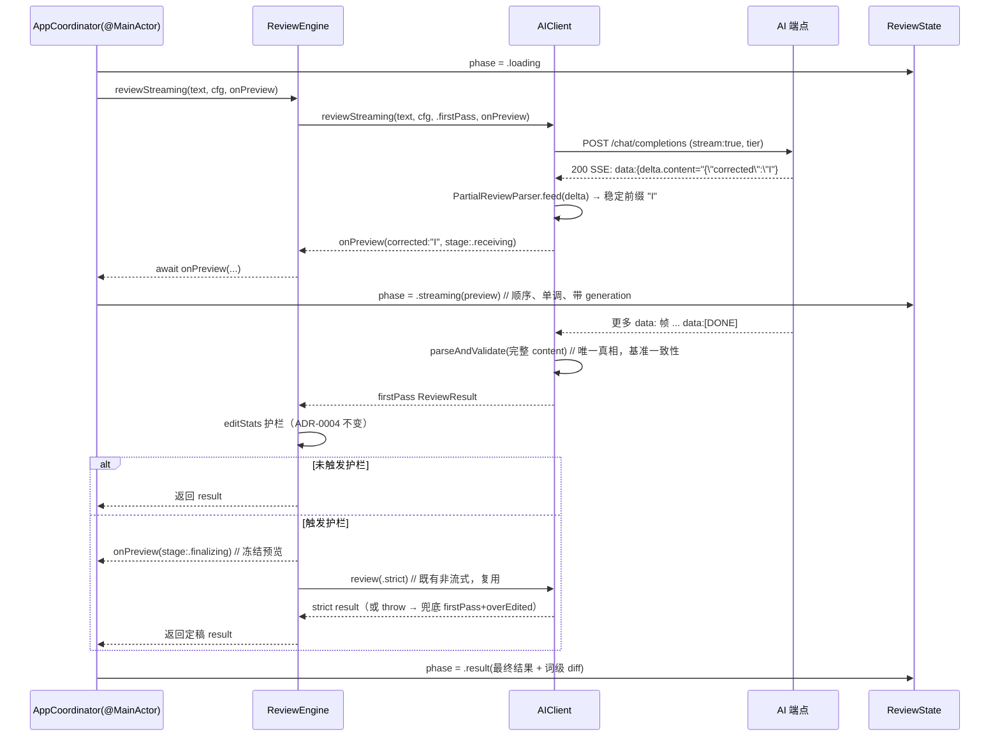

<!-- doc-init template version: v1.0 -->
# Design: streaming-incremental-render

- **Owner**: 技术方案官（Claude）on behalf of wu.nerd
- **Reviewers**: 编排官、wu.nerd
- **创建日期**: 2026-06-30
- **基于 proposal**: [proposal.md](./proposal.md)
- **Related spec（spec-delta）**: [specs/grammar-review/spec.md](./specs/grammar-review/spec.md)
- **Constitution check**: 已通读 [`docs/overview/constitution.md`](../../overview/constitution.md)。本设计**不触碰任何红线判定逻辑**（详见 §7）：Constraint-1（key 只进 Keychain）不涉及；Constraint-2（不记录内容）不涉及（preview 仅在内存、不落盘/不入日志）；Constraint-3（最小改动护栏不可破坏）——editRatio 计算、短句豁免、超阈值 strict 重试机制、取较小版逻辑**一字不动**，仅新增「strict 请求自身网络失败时定稿 firstPass + overEdited」的错误兜底（ADR-0004 未规定该路径，且与「护栏不阻断出结果」一致，见 §3 决策 D6 与 §7）；Constraint-4（不改原选区）不涉及。**无冲突，无需走红线回退。**

## 1. 概述

把 LangFix 从「等完整 `ReviewResult` 再一次性渲染」（`loading → result`）升级为**真流式增量渲染**：后端开 `stream:true`，前端按 SSE `data:` 帧增量取 delta，用一个**预览专用、schema-aware 的容错扫描器**逐字输出 `corrected` 稳定前缀（打字机），其余结构化字段随解析进度补齐；全程带「校对预览中」标记。流结束后，**完整内容仍交既有 `parseAndValidate` 作唯一真相**，再跑既有最小改动护栏定稿——把「流式仅在非护栏路径生效」从**事前判定**重构为**事后定稿（预览→定稿）**。

核心工程纪律三条：

1. **既有非流式链路一字不改**（红线：不破坏既有 + 既有 6 个测试文件全绿）。流式是**并行新增入口**，内部 tier 循环镜像 `review()`，接受少量重复换零回归。
2. **预览扫描器永不参与正确性**——它有 bug 最多让预览不理想，最终输出永远由 `parseAndValidate` 决定。
3. **是否流式只看两点**：流式开关 AND 端点支持流式；结构化降级、护栏 strict 重试、repair 重试、截断重发**都不是回退理由**，统一走「预览→定稿」收敛。

## 2. 架构与方案

### 2.1 控制流（流式 happy path）



### 2.2 组件拆分与接口契约

| 组件 | 变更 | 接口契约（签名为设计示意，实现阶段可微调） |
|---|---|---|
| `AIClient` | ADDED 流式入口 + SSE 解析 + 流式能力缓存；既有 `review`/`chat`/`probe` 不动 | `func reviewStreaming(text:config:mode: onPreview: @MainActor @Sendable (StreamingPreview) async -> Void) async throws -> ReviewResult` |
| `ReviewProviding`（protocol） | ADDED 流式方法，**用 protocol extension 给默认实现**（默认回落非流式 `review` 并发一次「整体作为终值的 preview」），既有 conformer 无需强改 | `func reviewStreaming(text:config:mode:onPreview:) async throws -> ReviewResult`（默认实现见 §2.6） |
| `ReviewEngine` | ADDED `reviewStreaming`（流式 firstPass + 既有护栏定稿）；既有 `review` 仅加 D6 的 strict-throw 兜底（见 §3） | `func reviewStreaming(text:config: onPreview: @MainActor @Sendable (StreamingPreview) async -> Void) async throws -> ReviewResult` |
| `ReviewState.Phase` | ADDED `.streaming(StreamingPreview)` | 见 §2.3 |
| `StreamingPreview`（新类型，Models.swift） | ADDED | 见 §2.3 |
| `PartialReviewParser`（新文件） | ADDED 预览专用容错扫描器 | `mutating func feed(_ chunk: String) -> StreamingPreview?`（见 §2.4） |
| `ReviewView` | ADDED `.streaming` 分支（预览徽标 / 无 diff / 复制禁用 / 取消） | — |
| `AppCoordinator` | MODIFIED `start()`：按开关与能力选 `reviewStreaming` vs `review`，注入带 generation 的 `@MainActor` preview 回调 | — |
| `SettingsStore` / `AppConfig` / `SettingsView` | ADDED `streamingEnabled: Bool`（默认 true，UserDefaults） | — |
| `Prompt` | MODIFIED system 提示「优先输出 corrected 字段」（仅优化首字，不作正确性假设） | — |

### 2.3 数据模型变化

```swift
// Models.swift — 新增轻量预览值（独立于 ReviewResult，不污染其 hasIssues/overEdited 不变式）
struct StreamingPreview: Sendable {
    var corrected: String          // 稳定前缀（打字机）
    var summaryZh: String?         // 字符串闭合后整体填充
    var issues: [Issue]            // 仅「已完整闭合」的 issue object
    var alternative: String?
    var stage: Stage
    enum Stage: Sendable { case receiving, finalizing }  // 接收中 / 定稿中（含 strict 冻结）
}

// ReviewState.swift
enum Phase {
    case loading
    case streaming(StreamingPreview)   // 新增
    case result(ReviewResult)
    case error(String)
}

// AppConfig（Models.swift）+ SettingsStore：新增字段
var streamingEnabled: Bool   // 默认 true
```

> **编译影响点（必须同改，否则编译断）**：`TestHelpers.testConfig()` 直接构造 `AppConfig`，需补 `streamingEnabled` 参数（默认 true）。`StubProvider` 见 §2.6。

### 2.4 增量解析容错策略（核心难点）

**选型：自研 schema-aware 宽容扫描器，不引第三方、不用正则。** 理由：Swift 标准库无可依赖的部分 JSON parser；本项目 schema 小且稳定，自研状态机成本可控；正则无法可靠处理转义/跨 chunk/嵌套；失败可 fail-closed（不确定就不显示，最坏完整后一次性渲染，spec 明确接受）。

`PartialReviewParser` 维护完整 buffer，逐 delta 喂入，**显式字符状态机**：

- 状态：`topLevel / inKey / inStringValue(field) / escape / unicodeEscape(已收集位数, 是否高代理待配)`。
- 识别顶层 key：`corrected / summary_zh / issues / alternative / has_issues`。
- **`corrected`**：作为字符串值**逐字输出稳定前缀**——首字提前的关键。**只输出到最后一个安全边界**：
  - 不输出半截 escape（尾随单个 `\`）；
  - 不输出半截 `\uXXXX`（位数不足）；
  - **UTF-16 代理对成对输出**：高代理 `\uD83D` 必须等到低代理 `\uDE00` 配齐才作为一个 scalar（如 `😀`）输出；孤立低代理等待/丢弃该片段；
  - 不输出收尾引号区。
  - → 保证前缀**单调、永不显示乱码**。
- **`summary_zh / alternative`**：字符串闭合后整体填充（不逐字）。
- **`issues`**：单个 issue object 完整闭合（括号配平）才 decode 为 `Issue` 填充，避免半张卡片乱跳。
- **字段乱序必须不崩**：corrected 若晚到，preview 先空着；最坏完整后由最终 parse 一次性渲染。
- **铁律**：流结束后的完整 content 一律走既有 `parseAndValidate` 作唯一真相；parser 仅供预览。

> **与 spec「纯文本模式仍流式」的关键澄清（见 §8 Q1）**：本仓库 `.text` tier **并非真纯文本**——它只是不加 `response_format`，Prompt 仍要求 JSON，`parseAndValidate` 仍按 JSON 解析。故**所有 tier 的 preview 都走 JSON 字段扫描器**（不是「把累积文本直接当 corrected」）。「累积原始文本直接当 corrected」**仅在最终 `parseAndValidate` 彻底失败时**作为兜底（复用既有 `ReviewResult.fallback`，以本地输入或原始文本为 corrected）。这样既满足「纯文本端点也流式」（流照常发生），又不会把整段 JSON 误当修正文展示。

### 2.5 流式网络层与能力探测/回退

- **取流**：`URLSession.bytes(for:)` → `for try await line in bytes.lines`；解析 `data: ` 前缀帧，累积 `choices[0].delta.content`，`data: [DONE]` 或流结束即收尾；末帧捕获 `finish_reason`。`URLResponse` 的状态码在读 body 前即可拿到，故 **tier 降级循环（json_schema→json_object→text）照常包裹流式尝试**。
- **流式能力缓存独立于结构化 tier 缓存**（正交）：

```swift
enum StreamSupport: Sendable { case unknown, supported, unsupported }
// 独立 actor 缓存，key = "baseURL|model"；tier 缓存决定 response_format，本缓存决定是否加 stream:true
shouldStream = cfg.streamingEnabled && streamCache[key] != .unsupported   // 未知时乐观尝试，不加探测 RTT
```

- **回退/缓存判据（精确，Codex 评审强化）**：

| 现象 | 判定 | 动作 | 是否缓存 unsupported |
|---|---|---|---|
| 200 但 body 非 SSE / 全程无 `data:` 帧 | 协议级不支持流式 | 静默回退非流式 | **是** |
| 400 且 body 文本指明 `stream`/该参数不支持 | 协议级不支持流式 | 静默回退非流式 | **是** |
| 400 且 body 指向 `response_format`/结构化参数 | 结构化 tier 问题 | 既有 tier 降级（仍尝试流式） | 否 |
| 400 body 模糊不可判 | 先按 tier 降级；仍不行再回退非流式 | 既有降级 → 非流式 | 否（降级），最终非流式不缓存 |
| 半截断流 / 临时 EOF / SSE 外层 chunk 偶发解码失败 | **瞬时异常**，非协议级 | 本次请求切 `.finalizing` 后台非流式定稿 | **否（不永久污染；最多给缓存 TTL）** |
| 最终完整 content `parseAndValidate` 失败 | **解析问题，≠ 流式不支持** | 既有 repair / tier 降级 / 纯文本兜底 | **否** |
| 401/403/429/5xx | 鉴权/限流/服务端错误 | 按既有错误路径**上抛**（不当流式不支持） | 否 |

> **关键修复（Codex 高-2）**：现有 `chat()` 抛 `.server(400)` 时**丢弃了 body**（`AIClient.swift:167`）。流式 chat 必须**保留 400 响应 body**做上述分类（`stream` vs `response_format`）。实现时为流式路径单独读取并分类 400 body，不复用会丢 body 的既有分支。

- **回退时机的用户可见性**：preview 尚未发出 → 全静默重跑非流式（用户无感）；preview 已发出后流半截异常 → 保持「校对预览中」标记、切 `.finalizing`，后台非流式定稿成功后再标「最终结果」，**不弹错**。

### 2.6 协议边界与依赖注入（Codex 中-2）

`ReviewEngine` 依赖 `ReviewProviding`（可注入，供 `StubProvider` 测试）。为不破坏注入：

- `ReviewProviding` **新增** `reviewStreaming(...onPreview:)`，并由 **protocol extension 提供默认实现**：默认调既有 `review(...)` 拿最终结果，发一次「以最终 corrected 为 preview（`stage:.finalizing`）」再返回。→ 既有 conformer（含 `StubProvider`）**无需强改即可编译**。
- `AIClient` **override** 默认实现，提供真流式。
- `StubProvider`（测试）**可选 override**，按脚本分段发 preview，用于状态机/顺序/取消测试。

### 2.7 preview 回调的顺序、单调与取消屏障（Codex 高-4，UI 最实际风险）

- 回调签名 `@MainActor @Sendable (StreamingPreview) async -> Void`，**由流读取循环 `await` 顺序调用**（**不**用 fire-and-forget `Task{}` 投递，避免乱序）。
- AppCoordinator 注入的回调携带 **generation/task identity**（每次 `start()` 自增）：仅当 `generation == 当前` 且 `!Task.isCancelled` 才应用，**杜绝旧任务 preview 污染新 state / 取消后更新已关窗**。
- **单调前缀守卫**：新 preview 的 `corrected` 长度 < 已显示长度时不回退覆盖（极端乱序保护）。
- 节流（可选）：每 ≥N ms 或每 ≥M 字符发一次，避免 MainActor 洪泛（不影响「首字早于末字」断言）。

## 3. 关键决策

| 决策点 | 选择 | 备选 | 理由 | 关联 |
|---|---|---|---|---|
| D1 入口形态 | 并行新增 `reviewStreaming`，既有 `review` 不改 | 改造 `review` 兼容流式 | 红线「不破坏既有」+ 既有测试零回归；少量重复可接受 | 红线 |
| D2 preview 模型 | 独立 `StreamingPreview` 值 | 复用 `ReviewResult` 部分态 | 不污染 ReviewResult 的 hasIssues/overEdited 不变式 | §2.3 |
| D3 增量解析 | 自研 schema-aware 容错扫描器（预览专用） | 第三方 parser / 正则 | 无现成库；fail-closed；最终真相仍是 `parseAndValidate` | §2.4 |
| D4 是否流式判据 | 仅「开关 AND 端点支持」；流式能力缓存独立于结构化 tier | 把结构化降级也当回退 | proposal Q2 拍板；正交职责 | proposal §6 Q2 |
| D5 strict 轮是否流式 | **不流式**：冻结第一版预览、切 `.finalizing`、strict 走既有非流式 | strict 也流式 | 避免双打字机交叉闪烁；strict 复用 100% 既有测试代码 | proposal §6 Q1 |
| D6 strict **请求失败**兜底 | firstPass 超阈值但 strict **throw** 时 → 定稿 firstPass + `overEdited=true`；**统一应用于 `review` 与 `reviewStreaming`** | 仅流式兜底（行为不对称）/ 维持现状抛错 | 与 Constraint-3「护栏不阻断出结果」一致；避免「关开关行为变差」；ADR-0004 未规定 strict-throw 路径（仅规定「strict 返回后仍超阈值」）。两位评审共识采纳 | §7、ADR-0004 |
| D7 截断 finish_reason==length | 切 `.finalizing` 冻结预览、后台 bump/非流式定稿，**不擦预览、不标流式不支持** | 直接回退非流式擦掉预览 | Codex 高-3：已显示预览不应被擦成空 | §2.5 |
| D8 text tier preview | 所有 tier 都走 JSON 字段扫描器；raw-text 仅最终 parse 失败时兜底 | text tier 直接把累积文本当 corrected | Codex 高-1：本仓库 text tier 仍是 JSON，直接当 corrected 会显示整段 JSON | §2.4、§8 Q1 |

## 4. 影响分析

### 4.1 受影响的 capability

| Capability | 影响类型 | 需更新 spec |
|---|---|---|
| grammar-review | MODIFIED（新增 streaming 态与预览→定稿语义；最终展示契约不变） | spec-delta 已含 4 ADDED + 1 MODIFIED；实现归档时把 `TBD(...)` 覆盖测试替换为真实路径 |

### 4.2 受影响的接口

| 接口 | 影响 | 兼容性 |
|---|---|---|
| `ReviewProviding` | ADDED `reviewStreaming`（protocol extension 默认实现兜底） | 向后兼容，既有 conformer 不强改 |
| `AIClient` | ADDED `reviewStreaming` + SSE 解析 + 流式能力缓存；`review`/`chat`/`probe` 不变 | 兼容 |
| `ReviewEngine` | ADDED `reviewStreaming`；`review` 仅加 D6 strict-throw 兜底 catch | 兼容（行为对既有成功路径不变，仅补错误兜底） |
| `ReviewState.Phase` | ADDED `.streaming` case | 穷举 switch 处需补分支（`ReviewView`） |
| `AppConfig` / `SettingsStore` | ADDED `streamingEnabled` | 默认 true；旧 UserDefaults 无该 key → 取默认 |

### 4.3 受影响的运维

个人 macOS App，无服务端监控/告警/SOP。回滚预案：流式开关本身即运行时回滚开关（关 → 完全走既有非流式路径）；代码层面 `reviewStreaming` 与 `review` 解耦，必要时入口直接固定走 `review` 即可彻底禁用流式。

## 5. 测试策略

| 测试类型 | 范围 | 关联 Requirement |
|---|---|---|
| 单元（parser） | corrected 跨任意 chunk 切分；escape/`\n`/`\"` 跨 chunk；`\uXXXX` 含**代理对**跨 chunk；半个 issue object 不输出、闭合才出；字段乱序不崩；malformed 最坏不产 preview 但完整后仍可 parse | 流式增量渲染 / 其余字段增量补齐 |
| 单元（AIClient SSE） | `StreamingStubURLProtocol`（handler 返回 `[Data]` 多块、多次 `didLoad` 增量喂 AsyncBytes）：正常分帧解析；200-非 SSE→回退；400-stream-unsupported vs 400-response_format 分类；finish_reason==length→定稿不擦预览；半截流→本次非流式定稿且**不缓存 unsupported** | 流式能力探测与静默回退 |
| 单元（顺序/取消，**Codex 低-2**） | `ReviewEventRecorder` 记录 phase 跳转：**取消后不再发 preview/result**；**旧任务 preview 不污染新任务**（generation 守卫）；单调前缀守卫 | 流式态可取消 |
| 端到端（确定性「首字早于末字」） | `StreamingMockOpenAIServer`（`text/event-stream`，分帧 flush、可控顺序）：先发首帧 corrected 前缀，gate 等 recorder 见到 `.streaming(corrected 非空)` 再放末帧；**断言 `.streaming` 在 `.result` 之前**（顺序断言，非 wall-clock） | 流式增量渲染（首字时间戳 < 末字） |
| 端到端（预览→定稿） | firstPass 大改 → strict 小改：断言 `.streaming(.receiving)` → `.streaming(.finalizing)` → `.result(strict)`；预览标记消失、**终态才出 diff**；两轮都超阈值断言 `overEdited`；**strict throw → firstPass + overEdited（D6 新单测）** | 流式预览到定稿 / 展示结构化修正 |
| 行为开关 | 关开关：请求**不带** `stream:true`，状态机**不经过** `.streaming`（`loading→result`）；text tier 流式：流照常、issues 空不报错、不回退 | 流式渲染配置开关 / 纯文本模式下仍流式 |
| 回归 | 既有 6 文件全绿：`AIClientTests` / `ReviewEngineGuardTests` / `MockServerE2ETests` / `KeychainStoreTests` / `DiffEngineTests` / `ModelsTests` | 红线：既有覆盖不回归 |

> 测试 target 当前为 Swift 5 语言模式（`Package.swift`），新增流式 mock 的 `@Sendable`/actor 取舍沿用该约束，与既有 `MockOpenAIServer` 一致。

## 6. 兼容性与迁移

无破坏性变更。新增 `streamingEnabled` 默认 true：旧用户升级后默认开启流式；端点不支持则静默回退，体验不退化。无数据迁移。

## 7. 红线检查

- [x] 已对照 [constitution.md](../../overview/constitution.md) 四条红线逐条检查。
- [x] **未触及红线判定逻辑**，无需强制覆盖记录：
  - **Constraint-1（key 只进 Keychain）**：本 change 不碰密钥存储路径。
  - **Constraint-2（不记录内容）**：`StreamingPreview` 仅存活于内存与 UI，**不写日志、不落盘**；SSE delta 不进日志（日志仍只允许 requestId/耗时/token/状态码）。
  - **Constraint-3（最小改动护栏不可破坏）**：editRatio 仍在**完整 corrected** 上算、短句豁免、超阈值 strict 重试、取较小版、`overEdited` 置位**算法全部一字不动**；diff 仍仅在完整 corrected 定稿时渲染（流式期间无 diff）。**唯一新增**是 D6——strict **请求自身网络失败**（throw，非「返回后仍超阈值」）时定稿 firstPass + `overEdited`。ADR-0004 §2.3 仅规定「strict 返回后仍超阈值 → 展示较小版」，**未规定 strict-throw 路径**；本兜底填补该空白且与红线明文「护栏不阻断出结果、始终展示一个结果」**同向**，不削弱护栏。**结论：属错误路径硬化，非护栏算法变更，不构成红线触碰。** 仍在 §10 后续动作请用户对此知情背书。
  - **Constraint-4（不改原选区）**：不涉及。

## 8. Clarifications（含红线强制覆盖）

### Q1: spec「纯文本模式仍流式」与本仓库 `.text` tier 实现不一致，如何落地？
**A**: spec/proposal 的心智模型是「text tier = 端点吐纯文本」，但本仓库 `.text` tier 实际只是**不加 `response_format`**，Prompt 仍要求 JSON、`parseAndValidate` 仍按 JSON 解析（`AIClient.swift:139` 的 `.text` 分支 + `Prompt.system` 仍要 JSON）。因此设计**遵从代码事实**：所有 tier 的 preview 都走 JSON 字段扫描器；「累积原始文本直接当 corrected」仅在最终 `parseAndValidate` 彻底失败时作兜底（既有 `ReviewResult.fallback`）。这样「纯文本端点也流式」（流照常发生、issues 可空）与「不把整段 JSON 当修正文」两个目标同时满足。**该澄清不改 spec 行为意图，只校正实现假设；提请编排官/用户知情。**

### Q2: D6 strict-throw 兜底是否需要红线强制覆盖？
**A**: 不需要（见 §7 论证）。它不改 editRatio/阈值/重试触发，只在 strict 请求 throw 时按「护栏不阻断出结果」定稿 firstPass。两位评审共识采纳。仍列入 §10 请用户背书。

### 红线强制覆盖记录
不适用（本 change 未触碰任何红线判定逻辑）。

## 9. 风险

| 风险 | 缓解 |
|---|---|
| 自研 partial parser 出 bug 导致预览乱渲染（escape/`\uXXXX`/代理对/嵌套 issues 最易错） | parser **fail-closed + 仅供预览**，最终真相恒为 `parseAndValidate`；单测覆盖任意 chunk 切分、代理对、半 object；组合字符/ZWJ emoji 视觉抖动至少有测试 |
| 端点「声称支持但流式异常」（半截流/非标 SSE） | 运行时分类：协议级不支持→缓存+静默回退；瞬时异常→本次非流式定稿不缓存（不永久污染，最多 TTL） |
| 400 同时可能是 response_format 或 stream 不支持 | 保留 400 body 分类（Codex 高-2）；模糊时先 tier 降级再回退非流式 |
| preview 跨 MainActor 乱序/取消竞态/旧任务污染 | 回调 `@MainActor` 顺序 `await`；generation 守卫 + 单调前缀守卫 + `Task.isCancelled` 检查；专测覆盖 |
| strict 重试覆盖预览第一版被感知为「闪烁」 | 全程「校对预览中」+ 定稿才标「最终结果」+ 终态才出 diff/复制；strict 不流式（冻结预览） |
| 状态机/取消语义回归 | `.streaming` 继承 loading 取消语义；既有 6 测试文件回归全绿为硬门 |
| 字段顺序无法强保证（corrected 晚到首字收益降） | Prompt 提示优先 corrected（best-effort）；parser 任意顺序不崩；最坏完整后一次性渲染（spec 接受） |

## 10. Codex 交叉评审摘要

- **评审轮数**：2 轮收敛（第 1 轮双方并行独立产方案；第 2 轮 Codex 对合并设计做对等评审，全部采纳无悬而未决高级分歧）。
- **共识（双方独立得出）**：并行新增 `reviewStreaming` 入口 + preview 回调；新增 `.streaming` Phase 继承取消；schema-aware **预览专用**容错扫描器（最终真相恒为 `parseAndValidate`）；流式能力缓存**独立于**结构化 tier；静默回退；strict 轮**不流式**、冻结预览后定稿。
- **采纳的 Codex 关键意见**：
  1. （高）`.text` tier 在本仓库仍是 JSON，不能把累积文本直接当 corrected → 改为所有 tier 走 JSON 扫描器、raw-text 仅最终 parse 失败兜底（D8 / §8 Q1）。
  2. （高）stream 不支持识别不能只看「200 非 SSE」；400 也可能是 stream 不支持，且既有 `chat` 丢了 400 body → 保留并分类 400 body（§2.5 表 + 修复注）。
  3. （高）`finish_reason==length` 不应擦掉预览 → 切 `.finalizing` 后台 bump 定稿（D7）。
  4. （高）preview 回调需顺序+取消屏障 → `@MainActor` 顺序 `await` + generation + 单调前缀守卫（§2.7）。
  5. （中）strict-throw 兜底**统一**到 `review()` 而非仅流式 → D6（消除行为不对称）。
  6. （中）`ReviewProviding` 协议边界 → protocol extension 默认实现，`StubProvider` 不强改（§2.6）。
  7. （中）`\uXXXX` 按 UTF-16 代理对成对输出（§2.4）。
  8. （低）瞬时断流不永久污染 stream 缓存（§2.5 表）；补「取消/旧任务污染」状态机测试（§5）。
- **反驳的 Codex 意见**：无（Round-2 全部为有效缺陷或增强，悉数采纳）。
- **剩余分歧**：无。D6 与 §8 Q1 两点虽已共识采纳，仍提请用户在 §11 知情背书（前者错误路径硬化、后者校正 spec 实现假设）。

## 11. 验收要点（交给开发官，含 dev↔test 内循环）

- **AC-1 首字提前（确定性）**：`StreamingMockOpenAIServer` 分帧；断言事件序列出现 `.streaming(corrected 非空)` 早于 `.result`（顺序断言，非时钟）。对应测试入口：新增 `StreamingE2ETests`。
- **AC-2 结构化分区不糊屏**：构造按字段顺序吐出的流，断言 corrected 逐字、summary/issues 按分区填充、**流式期间无 diff 高亮**。
- **AC-3 预览→定稿**：firstPass 大改→strict 小改，断言 `.receiving`→`.finalizing`→`.result(strict)`、预览标记消失、终态才出 diff；两轮超阈值断言 `overEdited`；**strict throw → firstPass+overEdited（D6 新单测）**。
- **AC-4 静默回退**：200-非 SSE / 400-stream-unsupported → 断言发起非流式第二请求、终态 `.result` 无 `.error`、缓存标 unsupported；**400-response_format → 断言是 tier 降级而非回退**；**最终 parse 失败 → 断言走 repair/兜底而非污染 stream 缓存**。
- **AC-5 开关**：关开关→请求不带 `stream:true`、不经过 `.streaming`。
- **AC-6 取消/隔离**：streaming 中取消→流式 task 被 cancel、关窗、不再发 preview/result；旧任务 preview 不污染新任务。
- **AC-7 红线回归**：既有 6 个测试文件全绿；日志不含原文/修正文/SSE delta。
- **AC-8 护栏算法不变**：`ReviewEngineGuardTests` 全绿；editRatio 仍在完整 corrected 上算。

## 12. 后续动作建议（用于触发联动）

- [ ] **请用户背书 D6**（strict-throw 兜底统一到 `review()`，§7/§8 Q2）——属护栏错误路径硬化，需用户对「护栏相邻代码改动」知情同意。
- [ ] **请用户/编排官确认 §8 Q1**（text tier 实现假设校正，不改 spec 意图）。
- [ ] 实现阶段同步更新 `docs/architecture/data-flow.md`（时序图加 loading→streaming→finalizing→result；diff 仅终态；错误表加「流式不可用→静默非流式回退」；Schema 章节注明 partial parser 仅预览）。
- [ ] 实现阶段更新模块文档 `docs/architecture/modules/ai-client.md`（SSE 解析 / 流式能力缓存 / 回退分类）、`review-window.md`（streaming 态 / 预览标记 / 复制禁用 / 取消语义）。
- [ ] 归档阶段把 spec-delta 中 `TBD(...)` 覆盖测试替换为真实测试路径。
- [ ] 无需离线数据验证 / 对账；无需新埋点 / 监控（个人 App，NFR-5 隐私不变）。
